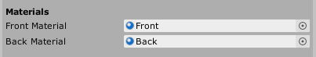
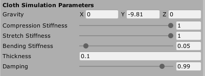
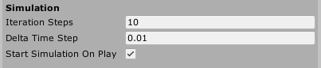

GPU Cloth Simulation For Real-time Application
---

This repository is still currently under development, so everything is still in testing mode. A lot of things will break, download at your own risk :/

My goal is to replicate what this legend did: https://youtu.be/kCGHXlLR3l8 (A smooth and interactive cloth simulation)

Currently, my cloth simulation uses Postion Based Dynamics and supports:
- Distance Constraint
- Bending Constraint
- Point Triangle Distance Constraint (Self Collision)
- Aerodynamics (Wind Effect)

Features comming soon:
- Vivace Gauss Seidel Method for optimization on GPU (random graph coloring)
- Primitive Shape Collision (Sphere, Box and Capsule)

Look at my plan on [Milanote](https://app.milanote.com/1JS0tP1NMEwO2f?p=qYevXFgGMpr) for more details.

Check out my [YouTube Playlist](https://www.youtube.com/playlist?list=PLlnBGPe6GFdP8So9oS0YVoVjqkmJoREI_) where I record my journey on how I approach this problem!

Support me on [Patreon](https://www.patreon.com/voxelltechnologies) so that I can allocate more time to work on this project!

How to use?
---
*Note: The GPU version is not fully developed yet, this tutorial section will not work for the GPU version.
1. Create a mesh in [Blender](https://blender.org) that you want to simulate.
2. Use my custom Blender Addon - [Cloth Exporter Tool](https://github.com/voxell-tech/ClothExporter) to transform your mesh into PBD form and export it into your Unity's `StreamingAssets` folder.
3. Create an empty GameObject in Unity.
4. Drag and drop `CPUClothSimulation.cs` or `GPUClothSimulation.cs` script onto the GameObject. (Check [Cloth Configurations](#cloth-configurations) for more cloth parameters' information.)
5. Select the correct JSON file that the Blender Cloth Exporter Tool exports using the button - `Select JSON File`.
6. Press the button - `Load Data from JSON`.
7. Put in your `Front Material` and `Back Material`.
8. Press `Build Mesh` to build the mesh that you have modeled in Blender.
9. Press `Create Back Side` to build the other side of the mesh.
10. Press `Apply Materials` to apply materials on both sides.

Cloth Configurations
---
These are the similar parameters in both CPU and GPU Cloth Simulation:

This determines the front material and back material for the cloth.

Tweak these parameters to change the behaviour for the cloth.
1. Gravity: Constant acceleration.
2. Compression Stiffness: Coefficient for distance constraint when 2 particles are too close together.
3. Stretch Stiffness: Coefficient for distance constraint when 2 particles are too far away.
4. Bending Stiffness: Coefficient for bending constraint when 2 neighbor triangles are not at their rest angle.
5. Thickness: Cloth thickness for all collisions.
6. Damping: Multiplier of velocity for every simulation to reduce velocity (as air resistance).

Tweak these parameters to balance between accuracy and performance.
1. Iteration Steps: Number of iterations to solve constraints for every simulation.
2. Delta Time Step: Time pass between 2 simulations.
3. Start Simulation On Play: Choose if you want to start the simulation once you enter play mode.

License
---
This project is under the GNU Public License, Version 3.
